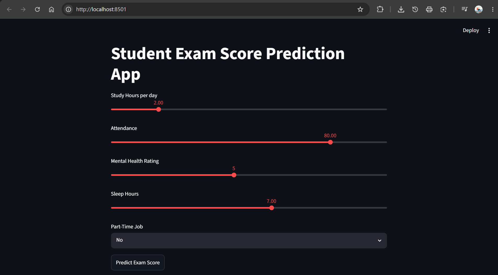
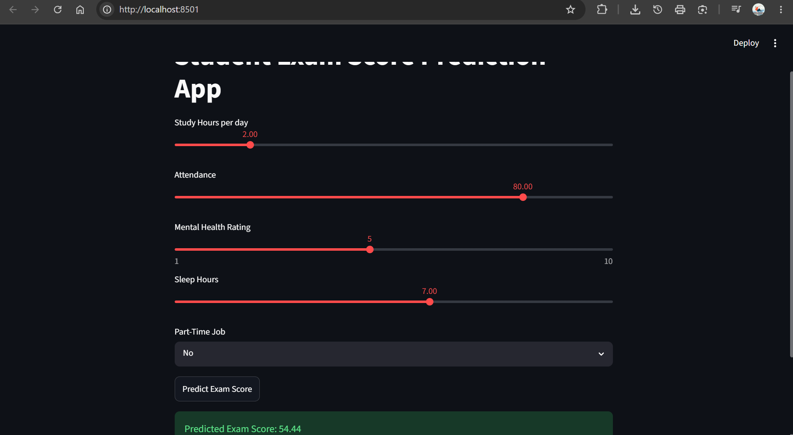

# 🎓 Student Marks Score Prediction System

A Machine Learning project developed using **Python** to predict a student's **exam score (0–100)** based on various academic and personal factors. The project follows the complete Machine Learning pipeline — from data preprocessing and exploratory data analysis (EDA) to model training, evaluation, and deployment using **Streamlit**.

---

## 📑 Table of Contents

- [Project Overview](#-project-overview)
- [Objectives](#-objectives)
- [Problem Statement](#-problem-statement)
- [Features](#-features)
- [Technologies Used](#️-technologies-used)
- [Project Structure](#-project-structure)
- [Screenshots](#-screenshots)
- [Installation Guide](#-installation-guide)
- [How to Use the App](#-how-to-use-the-app)
- [Input Features](#-input-features)
- [Output](#-output)
- [Project Workflow](#-project-workflow)
- [Machine Learning Algorithms](#-machine-learning-algorithms)
- [Evaluation Metrics](#-evaluation-metrics)
- [Sample Input & Output](#-sample-input)
- [Live Deployment (Streamlit Cloud)](#-live-deployment-streamlit-cloud)
- [Future Enhancements](#-future-enhancements)
- [Learning Outcomes](#-learning-outcomes)
- [Author](#-author)
- [License](#-license)

---

## 📌 Project Overview

The **Student Marks Score Prediction System** is a regression-based Machine Learning application that predicts a student's expected exam score using historical student data. The model learns relationships between students' study habits and their exam performance, then estimates the exam score for new students.

The project demonstrates the complete Machine Learning workflow, including data preprocessing, exploratory data analysis (EDA), model training, model evaluation, and deployment through an interactive Streamlit web application.

---

## 🎯 Objectives

- Predict students' exam scores on a scale of **0 to 100**.
- Analyze how different lifestyle and academic factors affect student performance.
- Compare multiple regression algorithms to identify the best-performing model.
- Build an easy-to-use web application for real-time score prediction.
- Demonstrate an end-to-end Machine Learning workflow.

---

## ❗ Problem Statement

Educational institutions often struggle to identify students who may perform poorly before examinations. Since academic performance is influenced by multiple factors such as study habits, attendance, sleep, and mental health, predicting student performance manually is difficult.

This project addresses the problem by using Machine Learning to analyze these factors and predict a student's expected exam score, enabling timely academic support and better learning outcomes.

---

## ✨ Features

- 📊 Predicts student exam score (0–100)
- 📈 Exploratory Data Analysis (EDA)
- 🧹 Data preprocessing and cleaning
- 🤖 Comparison of multiple regression models
- 📉 Model evaluation using RMSE and R² Score
- 🌐 Interactive Streamlit web application
- 💡 Instant score prediction based on user input
- 🧩 Modular, reusable source code (`src/`) separate from the notebook and the app

---

## 🛠️ Technologies Used

### Programming Language
- Python

### Machine Learning Libraries
- Scikit-learn
- Pandas
- NumPy

### Data Visualization
- Matplotlib
- Seaborn

### Model Storage
- Joblib

### Web Framework
- Streamlit

### Development Tools
- Visual Studio Code
- Jupyter Notebook
- Git & GitHub

---

## 📁 Project Structure

```text
Student-Marks-Score-Prediction/
│
├── app/
│   └── app.py                     # Streamlit web application (UI)
│
├── src/
│   ├── __init__.py
│   ├── data_preprocessing.py      # Load, clean, and prepare the dataset
│   ├── train.py                   # Train, compare, and save the best model
│   ├── predict.py                 # Load the saved model and make predictions
│   └── utils.py                   # Shared paths, constants, and helper functions
│
├── data/
│   └── student_habits_performance.csv
│
├── models/
│   └── best_model.pkl
│
├── notebooks/
│   └── student_marks_prediction.ipynb
│
├── screenshots/
│   └── app_screenshot.png
│
├── README.md
├── requirements.txt
└── .gitignore
```

**Why a `src/` folder?** Splitting the notebook's logic into `data_preprocessing.py`, `train.py`, `predict.py`, and `utils.py` keeps the data pipeline, model training, and prediction logic reusable and testable, instead of living only inside the notebook or being duplicated inside the Streamlit app. `app/app.py` imports directly from `src/predict.py`.

---

## 📸 Screenshots

> Add your own screenshots of the running app here. Run the app locally (see [Installation Guide](#-installation-guide)), take a screenshot of the browser window, save it into the `screenshots/` folder, and update the image path(s) below.

**App home screen**

```md

```

**Prediction result**

```md

```

<details>
<summary>How to capture a good screenshot</summary>

1. Run the app locally: `streamlit run app/app.py`.
2. It opens automatically at `http://localhost:8501` in your browser.
3. Set a few sample slider values, click **Predict Exam Score**, and let the result appear.
4. Take a screenshot of the full browser window (Windows: `Win + Shift + S`, macOS: `Cmd + Shift + 4`).
5. Save it as `screenshots/app_screenshot.png` (and `screenshots/prediction_result.png` for the result state), commit, and push.

</details>

---

## 🧰 Installation Guide

Follow these steps to run the project on your own machine.

### 1. Prerequisites

- [Python 3.9+](https://www.python.org/downloads/) installed
- [Git](https://git-scm.com/downloads) installed
- (Optional but recommended) a code editor such as VS Code

### 2. Clone the repository

```bash
git clone https://github.com/anuj-0746/Student-Marks-Score-Prediction.git
cd Student-Marks-Score-Prediction
```

### 3. Create and activate a virtual environment (recommended)

**Windows**
```bash
python -m venv venv
venv\Scripts\activate
```

**macOS / Linux**
```bash
python3 -m venv venv
source venv/bin/activate
```

### 4. Install the dependencies

```bash
pip install -r requirements.txt
```

### 5. Run the Streamlit app

```bash
streamlit run app/app.py
```

Streamlit will start a local server and automatically open the app in your browser at:

```text
http://localhost:8501
```

If it doesn't open automatically, copy that URL into your browser manually.

---

## ▶️ How to Use the App

1. Once the app opens, you'll see sliders and a dropdown for the input features.
2. Set:
   - **Study Hours per day**
   - **Attendance (%)**
   - **Mental Health Rating**
   - **Sleep Hours**
   - **Part-Time Job** (Yes/No)
3. Click **Predict Exam Score**.
4. The predicted exam score (0–100) is displayed instantly below the button.

### Retraining the model (optional)

If you update the dataset or want to retrain the model yourself:

```bash
python -m src.train
```

This re-runs the full pipeline (`src/data_preprocessing.py` → `src/train.py`), compares Linear Regression, Decision Tree, and Random Forest via `GridSearchCV`, and overwrites `models/best_model.pkl` with the best-performing model.

You can also get a single prediction from the command line without opening the app:

```bash
python -m src.predict --study_hours 6 --attendance 92 --mental_health 8 --sleep_hours 7 --part_time_job No
```

---

## 📥 Input Features

- Study Hours Per Day
- Attendance (%)
- Mental Health Rating
- Sleep Hours
- Part-Time Job (Yes/No)

---

## 📤 Output

- **Predicted Exam Score (0–100)**

---

## 🔄 Project Workflow

1. Collect Student Dataset
2. Data Preprocessing (`src/data_preprocessing.py`)
3. Exploratory Data Analysis (EDA) (`notebooks/student_marks_prediction.ipynb`)
4. Feature Selection
5. Train-Test Split
6. Train Multiple Regression Models (`src/train.py`)
7. Evaluate Model Performance
8. Select the Best Model
9. Save the Trained Model (`models/best_model.pkl`)
10. Deploy using Streamlit (`app/app.py` + `src/predict.py`)

---

## 🤖 Machine Learning Algorithms

- Linear Regression
- Decision Tree Regressor
- Random Forest Regressor

Each model is tuned with `GridSearchCV`, and the one with the lowest RMSE is refit on the full dataset and saved as:

```text
models/best_model.pkl
```

---

## 📊 Evaluation Metrics

- Root Mean Squared Error (RMSE)
- R² Score (Coefficient of Determination)

The model with the lowest RMSE and highest R² Score is selected for deployment.

---

## 📊 Sample Input

| Feature | Value |
|---------|------:|
| Study Hours Per Day | 6 |
| Attendance | 92% |
| Mental Health Rating | 8 |
| Sleep Hours | 7 |
| Part-Time Job | No |

## 📈 Sample Output

```text
Predicted Exam Score : 88.4
```

---

## 🚀 Live Deployment (Streamlit Cloud)

The app is designed to be deployed for free on **[Streamlit Community Cloud](https://streamlit.io/cloud)**. To deploy your own copy:

1. Push your latest code to GitHub (this repository).
2. Go to [share.streamlit.io](https://share.streamlit.io) and sign in with your GitHub account.
3. Click **Create app** → **From an existing repo**.
4. Select:
   - **Repository:** `anuj-0746/Student-Marks-Score-Prediction`
   - **Branch:** `main`
   - **Main file path:** `app/app.py`
5. Click **Deploy**. Streamlit Cloud will install everything listed in `requirements.txt` and launch the app.
6. Once deployed, you'll get a public URL like:
   ```text
   https://student-marks-score-prediction-<random-id>.streamlit.app
   ```
7. Add that link at the top of this README (and in your internship report) once it's live, for example:

   ```md
   🔗 **Live App:** https://your-app-name.streamlit.app
   ```

> **Note:** Deploying requires signing in to Streamlit Cloud with your own GitHub account and authorizing access to this repository — this is a one-time manual step that has to be done from your browser.

---

## 🚀 Future Enhancements

- Student Login System
- Teacher Dashboard
- Performance Analytics
- PDF Report Generation
- Email Notifications
- Cloud Deployment
- College ERP Integration

---

## 📚 Learning Outcomes

- Data Collection
- Data Cleaning
- Exploratory Data Analysis (EDA)
- Feature Engineering
- Machine Learning Model Training
- Model Comparison
- Model Evaluation
- Model Deployment
- Streamlit Web Application Development
- Structuring an ML project into reusable modules (`src/`)

---

## 👨‍💻 Author

**Name:** Anuj

**Course:** Artificial Intelligence & Machine Learning (Python)

---

## 📄 License

This project is developed for educational and learning purposes. It may be modified and extended for academic, research, and non-commercial use.
